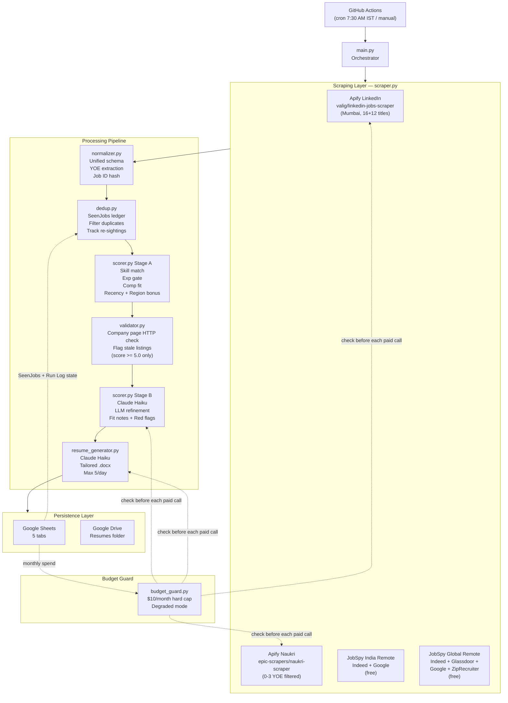
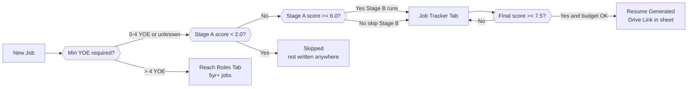
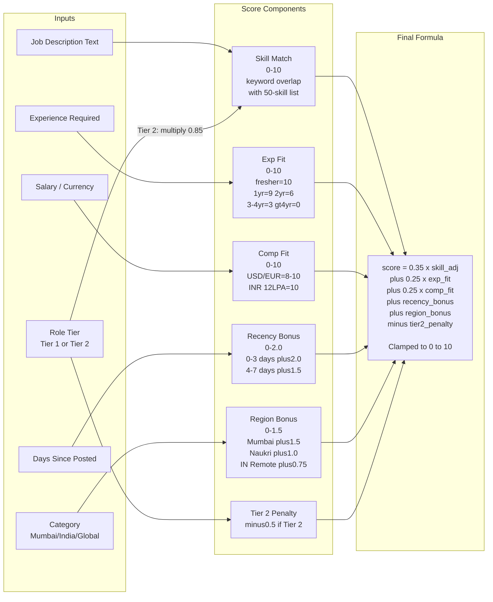
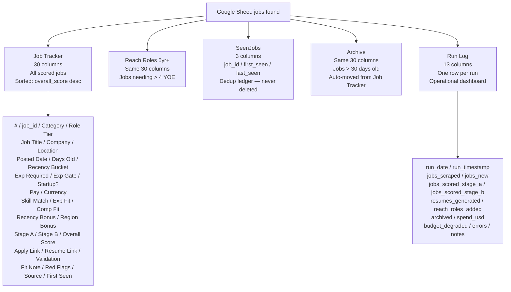
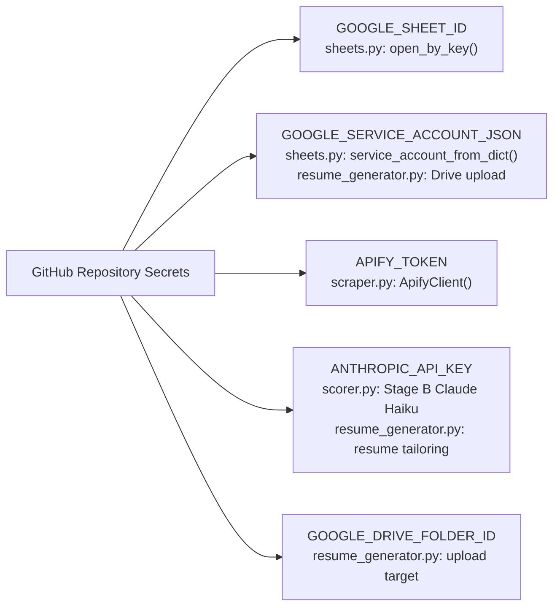

# JobRadar v1 — Architecture & Execution Flow

## System Architecture

---

## Execution Flow (Step by Step)

```mermaid
flowchart TD
    START(["GitHub Actions Trigger\n7:30 AM IST daily"])
    
    S1["Step 1\nLoad config.yaml\nInit budget guard\nConnect Google Sheet\nEnsure 5 tabs exist"]
    
    S2["Step 2 — SCRAPE\nLinkedIn Mumbai x2 tiers\nNaukri x2 tiers\nJobSpy India Remote x2 tiers\nJobSpy Global Remote x2 tiers"]
    
    S2_CHECK{{"Any jobs scraped?"}}
    
    S3["Step 3 — NORMALIZE\nMap to unified schema\nExtract YOE via regex\nGenerate SHA-256 job_id\nResolve role tier"]
    
    S4["Step 4 — DEDUP\nLoad SeenJobs from Sheet\nFilter: new vs re-sighted\nAppend new IDs immediately"]
    
    S5["Step 5 — STAGE A SCORE\nSkill match 0-10\nExperience gate\nComp fit 0-10\nRecency bonus +0 to +2\nRegion bonus +0 to +1.5\nRoute: Tracker / Reach / Skip"]
    
    S6["Step 6 — VALIDATE\nHTTP check company pages\nFlag stale listings\nscore >= 5.0 only"]
    
    S7{{"Budget OK?\nAPI key set?"}}
    
    S8["Step 7 — STAGE B SCORE\nClaude Haiku batch\n10 JDs per API call\nOnly score >= 6.0\nAdds fit_note red_flags\nFinal = avg of A and B"]
    
    S9["Step 8 — RESUME GEN\nClaude Haiku\nTop jobs score >= 7.5\nMax 5 per day\nUpload to Google Drive"]
    
    S10["Step 9 — WRITE TO SHEET\nSort by overall_score desc\nAppend to Job Tracker tab\nAppend to Reach Roles tab"]
    
    S11["Step 10 — MAINTENANCE\nUpdate last_seen for re-sighted\nArchive jobs > 30 days old"]
    
    S12["Step 11 — RUN LOG\nWrite stats row\nscraped new scored\nspend_usd errors"]
    
    END(["Run Complete"])
    EARLY_END(["Early Exit\nlog Run Log"])

    START --> S1
    S1 --> S2
    S2 --> S2_CHECK
    S2_CHECK -->|"No jobs"| EARLY_END
    S2_CHECK -->|"Has jobs"| S3
    S3 --> S4
    S4 --> S5
    S5 --> S6
    S6 --> S7
    S7 -->|"No"| S10
    S7 -->|"Yes"| S8
    S8 --> S9
    S9 --> S10
    S10 --> S11
    S11 --> S12
    S12 --> END
```

---

## Job Routing Decision Tree

---

## Stage A Scoring Formula

---

## Google Sheet Tab Structure

---

## Secrets & Environment Variables

